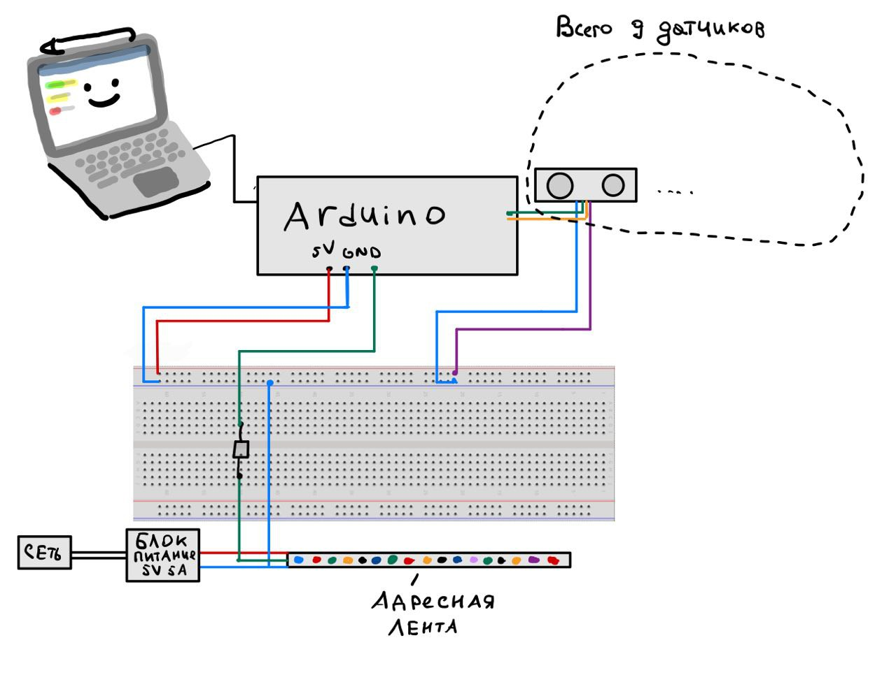

# Бесконтактный электронный ханг

Проект интерактивного музыкального инструмента, имитирующего игру на ханге с помощью ультразвуковых датчиков расстояния и генерации звука на ПК с использованием Python.

## Описание проекта

Бесконтактный электронный ханг представляет собой корпус с несколькими зонами, каждая из которых «читается» ультразвуковым датчиком HC‑SR04. Движение руки над конкретной зоной приводит к воспроизведению ноты, а расстояние до руки влияет на параметры звука.

Проект включает:

- Аппаратную часть на Arduino Mega (опрос датчиков, передача данных на ПК).
- Корпус и механику, спроектированные в CAD (например, SolidWorks).
- ПК‑приложение на Python (PyGame, PySerial, NumPy) для синтеза звука и визуализации.

## Возможности

- Несколько независимых зон ханга, каждая со своим датчиком HC‑SR04.
- Управление громкостью/высотой ноты в зависимости от расстояния до руки.
- Визуализация активных зон на экране.
- Возможность расширения до MIDI‑вывода и подключения внешних синтезаторов.

## Аппаратная часть

### Компоненты

- Микроконтроллер: Arduino Mega 2560.
- Ультразвуковые датчики: несколько HC‑SR04 (по одному на зону ханга).
- Дополнительная индикация (опционально): светодиоды или подсветка.
- Связь с ПК: USB (виртуальный COM‑порт) или через внешний интерфейс (например, RS‑485 с преобразователем).
- Корпус: 3D‑печатный или изготовленный другим способом, с посадочными местами под датчики.

### Общий принцип работы

1. Каждый датчик HC‑SR04 измеряет расстояние до руки пользователя над своей зоной.
2. Arduino периодически опрашивает все датчики и фильтрует значения.
3. Нормализованные расстояния отправляются на ПК по последовательному интерфейсу.
4. ПК‑приложение преобразует данные в звуковые события и визуализацию.

## Программная часть

### Прошивка для Arduino

Основные задачи прошивки:

- Инициализация датчиков HC‑SR04 и необходимых пинов.
- Циклический опрос всех датчиков с заданным периодом.
- Фильтрация шумов (усреднение, отбрасывание выбросов).
- Формирование пакета данных (массив расстояний) и отправка по последовательному порту.

### ПК‑приложение

Используемый стек:

- Python 3.x
- PyGame — генерация и воспроизведение звука.
- PySerial — работа с последовательным портом.
- NumPy — обработка данных с датчиков.

Основные функции приложения:

1. Подключение к последовательному порту и чтение пакетов от Arduino.
2. Преобразование расстояний в параметры звука (нота, громкость и т.д.).
3. Воспроизведение звука с помощью PyGame или отправка MIDI‑сообщений.
4. Визуализация зон ханга и их активности.

[Постер проекта](img/Beskontaktnyj-elektronnyj-hang-1-1.pdf)
